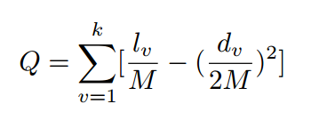

LPA算法C++实现
====

## 0.运行方法

```
$ make
$ ./lpa sample_networks/test.txt
```

* 文件夹`sample_networks`里是几个经典网络以及我自己的几个test
* 可以根据需要修改main函数


## 1.算法描述

给每个节点添加标签，初始以每个节点的id作为标签，标签传播过程中将每个节点的邻居节点的
标签中数量最多的标签作为该节点的标签。标签就代表该节点所属社区。

* 1 以节点id初始化标签
* 2 遍历每个节点，使用其邻居节点的标签中数量最多的标签更新其自身标签。
* 3 反复执行步骤2，直到满足终止条件。

***关于终止条件***
* 1 直接设置迭代次数
* 2 根据模块度的增加程度设定
* 3 每个节点的标签不再变化
* 4 其他

## 2.伪代码

中文：
```
输入:网络G=(V,E)具有|V|=n个节点和|E|=m条边，最大迭代次数maxt
输出:社团发现划分结果C={C1,C2,...Ck},k为社团数量
for each i in V
i.label = i
//每个节点分配唯一的标签
while 不满足终止条件
	g.labeled();
	t = t + 1;
```

## 3.模块度计算
模块度（Q，Modularity）是一种常用的衡量社团划分质量的标准。

常用的计算模块度的公式为：

`Q = sum(lv/Mv - dv*dv/2Mv*2Mv);(v from 1 to k)`



其中，lv是社团v内部所包含的边数，dv是社团v中所有节点的度值之和,Mv是网络的边数。

## 4.相似度指标


## 5.改进思路
	* 聚类系数与完全子图
